  

 

---

## 👩‍💻 About Me

I'm a **Telecom & ICT State Engineer** and **DataOps & Cloud Consultant** focused on building reliable systems at the intersection of **data engineering, cloud infrastructure, MLOps, and telecom operations**.

I enjoy turning complex technical requirements into **automated, observable, and production-ready solutions**.

* ⚙️ **Data & Pipelines** — ETL/ELT, Spark, SQL, Python, Airflow, Prefect
* ☁️ **Cloud & Infrastructure** — GCP, Azure, Docker, Kubernetes, Linux
* 🤖 **MLOps & Automation** — MLflow, DVC, FastAPI, CI/CD
* 📊 **Observability** — Prometheus, Grafana, Kibana, Zabbix
* 📡 **Telecom Operations** — OSS/BSS, network monitoring, incident management
* 🌍 **B2B Collaboration** — Technical work with international telecom teams and operators across multiple markets
* 🏫 **Founder** — [ITAAR Academy](#), a practical initiative focused on technology, learning, and collaboration

---

## 🧩 Technical Stack

<table>
<tr>

<td valign="top" width="50%">

### Data Engineering

  

  
  

<code>Python</code> · <code>SQL</code> · <code>Spark</code> · <code>PostgreSQL</code> · <code>MongoDB</code> · <code>Redis</code>

</td>

<td valign="top" width="50%">

### Cloud & Infrastructure

  

<code>GCP</code> · <code>Azure</code> · <code>Docker</code> · <code>Kubernetes</code> · <code>Linux</code> · <code>Nginx</code>

</td>

</tr>

<tr>

<td valign="top">

### DataOps & MLOps

  

  
  
  
  

<code>Airflow</code> · <code>Prefect</code> · <code>MLflow</code> · <code>DVC</code> · <code>FastAPI</code> · <code>CI/CD</code>

</td>

<td valign="top">

### Observability & Telecom

  
  
  
  

  
  
  
  
  

<code>Prometheus</code> · <code>Grafana</code> · <code>Kibana</code> · <code>Zabbix</code>

 

<code>NetAct</code> · <code>ENM</code> · <code>U2020</code> · <code>OSS/BSS</code> · <code>ServiceNow</code> · <code>Jira</code>

</td>

</tr>
</table>

---

## 🚀 Featured Projects

### 🛒 End-to-End MLOps Platform

**Production-oriented ML platform for predicting late e-commerce deliveries.**

`Python` `PostgreSQL` `MLflow` `DVC` `FastAPI` `Docker` `Azure Blob` `Prometheus` `Grafana`

**Highlights**

* End-to-end ML lifecycle from training to deployment
* MLflow model registry and champion model workflow
* DVC-based data/model artifact management
* Azure Blob Storage integration
* FastAPI prediction service
* Nginx reverse proxy
* Docker Compose infrastructure
* Prometheus + Grafana monitoring
* Automated CI/CD with GitHub Actions

---

### 📡 Telecom Network Operations Platform

**Engineering platform for simulating, ingesting, processing, and monitoring telecom network data.**

`Python` `Kafka` `PostgreSQL` `FastAPI` `Docker` `Grafana`

**Highlights**

* Network KPI and alarm simulation
* Kafka-based event streaming
* PostgreSQL operational data storage
* FastAPI APIs
* Network performance processing
* Real-time observability dashboards
* Containerized architecture

---

## 💼 Professional Background

### Data / Analytics Operations

* Built and maintained production **data processing and ETL workflows**
* Worked with Python, SQL, Spark, NoSQL databases, and workflow orchestration
* Supported production systems through monitoring, troubleshooting, and incident investigation
* Worked with international B2B technical teams on production-facing projects

### Telecom Network Operations

* Network monitoring and performance analysis across OSS platforms
* Incident investigation, troubleshooting, and operational support
* Worked with tools including **Nagios, Zabbix, NetAct, ENM, U2020, ServiceNow, Remedy, Jira, Kibana and Power BI**
* Supported technical teams working with multinational telecom operators

---

## 🏫 ITAAR Academy

**Founder · Technology & Practical Learning**

ITAAR Academy is a practical learning initiative focused on helping people **learn, practice, and share useful skills**.

> **Learn. Practice. Grow.**

Topics include technology, programming, IoT, cloud, languages, workshops, and hands-on learning.

---

## 📊 GitHub Activity

  

  

 

  

  

---

## 🌐 Connect

&nbsp;&nbsp;

&nbsp;&nbsp;

 

**Building reliable systems. Turning data into scalable solutions.**

 

