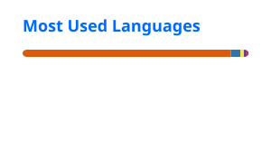

  

    

      

        
        
        
      

      ouahiba@matrix:~$
    

  

      

        ouahiba99@github:~$
        ./welcome --profile
        
      

      

        status
        DataOps • Cloud • MLOps • Telecom • Automation
      

      

        DataOps
        Cloud
        MLOps
        Telecom
        Automation
      

    

  

  

    
[00] identity

    

      

  

  

  

    
[01] system overview

    

      

        I'm a <strong>Telecom &amp; ICT State Engineer</strong> and <strong>DataOps &amp; Cloud Consultant</strong> focused on building reliable systems at the intersection of <strong>data engineering</strong>, <strong>cloud infrastructure</strong>, <strong>MLOps</strong>, and <strong>telecom operations</strong>.
      

      

        I enjoy turning complex technical requirements into <strong>automated, observable, and production-ready solutions</strong>.
      

      

        
      

    

  

  

    
[02] core capabilities

    

      

        <h3>Data engineering</h3>
        <ul>
          <li>ETL / ELT orchestration</li>
          <li>Python, SQL, Spark</li>
          <li>PostgreSQL, MongoDB, Redis</li>
          <li>Airflow, Prefect</li>
        </ul>
      

      

        <h3>Cloud infrastructure</h3>
        <ul>
          <li>GCP, Azure</li>
          <li>Docker, Kubernetes</li>
          <li>Linux, Nginx</li>
          <li>Production-ready deployment</li>
        </ul>
      

      

        <h3>MLOps &amp; automation</h3>
        <ul>
          <li>MLflow, DVC</li>
          <li>FastAPI services</li>
          <li>CI/CD automation</li>
          <li>Operational reliability</li>
        </ul>
      

      

        <h3>Observability &amp; telecom</h3>
        <ul>
          <li>Prometheus, Grafana</li>
          <li>Kibana &amp; log analysis</li>
          <li>OSS / BSS operations</li>
          <li>Network monitoring and support</li>
        </ul>
      

    

  

  

    
[03] featured projects

    

      
project 01

      <h3 class="matrix-project-title"><a href="https://github.com/ouahiba99/MLOPS_training">End-to-End MLOps Platform</a></h3>
      
<strong>Production-oriented ML platform for predicting late e-commerce deliveries.</strong>

      

        Python
        PostgreSQL
        MLflow
        DVC
        FastAPI
      

      <ul>
        <li>End-to-end ML lifecycle from training to deployment</li>
        <li>Model registry and champion model workflow</li>
        <li>Artifact tracking with DVC and data validation</li>
        <li>Monitoring, Docker, CI/CD, and cloud integration</li>
      </ul>
    

  

      
project 02

      <h3 class="matrix-project-title">Telecom Network Operations Platform</h3>
      
<strong>Engineering platform for simulating, ingesting, processing, and monitoring telecom network data.</strong>

      

        Python
        Kafka
        PostgreSQL
        FastAPI
        Grafana
      

      <ul>
        <li>Network KPI and alarm simulation</li>
        <li>Kafka event streaming and operational stores</li>
        <li>Real-time observability dashboards</li>
        <li>Containerized architecture for performant processing</li>
      </ul>
    

  

  

    
[04] work experience

    

      

        <h3>Data / analytics operations</h3>
        <ul>
          <li>Built and maintained production data processing and ETL workflows</li>
          <li>Worked with Python, SQL, Spark, NoSQL, and workflow orchestration</li>
          <li>Supported monitoring, troubleshooting, and incident investigation</li>
          <li>Collaborated with international B2B technical teams</li>
        </ul>
      

      

        <h3>Telecom network operations</h3>
        <ul>
          <li>Network monitoring and performance analysis across OSS platforms</li>
          <li>Incident investigation and troubleshooting</li>
          <li>Exposure to Nagios, Zabbix, NetAct, ENM, U2020, Jira, and Power BI</li>
          <li>Support for multinational telecom operators and teams</li>
        </ul>
      

    

  

  

    
[05] academy

    

      <h3 class="matrix-project-title">ITAAR Academy</h3>
      
<strong>Founder · Technology &amp; Practical Learning</strong>

      
ITAAR Academy is a practical learning initiative focused on helping people learn, practice, and share useful skills.

      

        learn
        practice
        grow
      

    

  

  

    
[06] github activity

    

      
      
    

    

      

        
      

      

        
      

      

        
      

    

  

  

    
[07] network

    

      <a href="https://github.com/ouahiba99">GitHub</a>
      <a href="https://linkedin.com/in/datadrivenmind">LinkedIn</a>
      <a href="mailto:ahmidouahiba@gmail.com">Email</a>
    

  

  
Building reliable systems. Turning data into scalable solutions.

