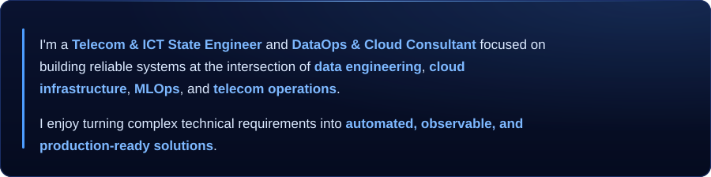
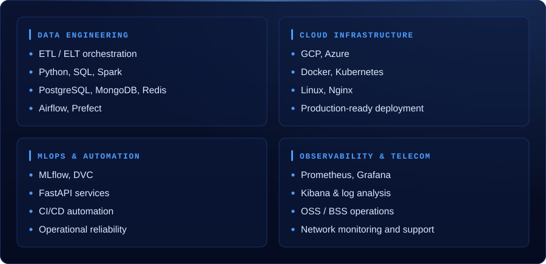
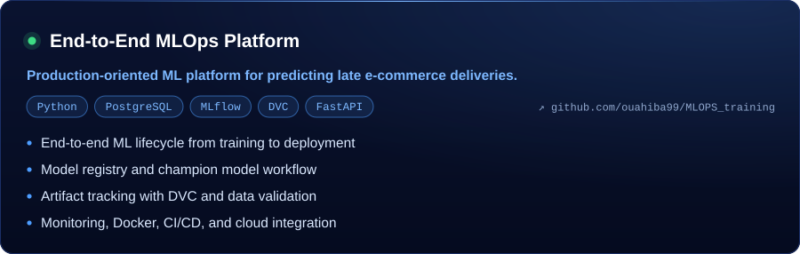
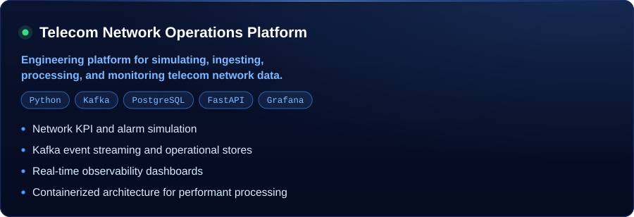
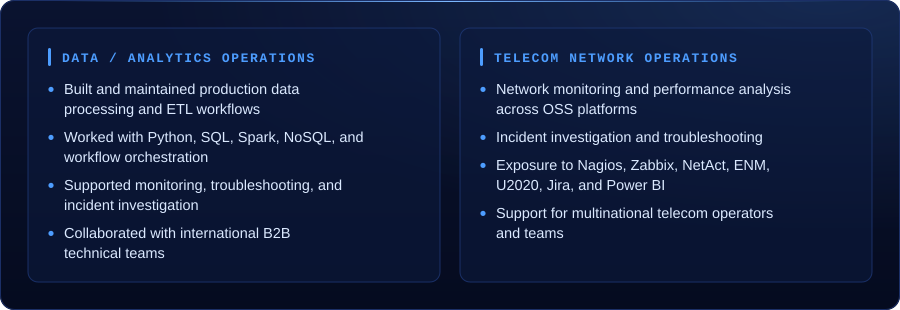
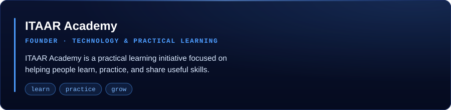

  

  

  

  

  <picture>
    <source media="(prefers-color-scheme: dark)" srcset="https://shieldcn.dev/badge/Data_Engineering-Pipelines-4d9dff.svg?variant=secondary&theme=blue&size=sm&mode=dark" />
    
  </picture>
  &nbsp;
  <picture>
    <source media="(prefers-color-scheme: dark)" srcset="https://shieldcn.dev/badge/Cloud-Infrastructure-4d9dff.svg?variant=secondary&theme=blue&size=sm&mode=dark" />
    
  </picture>
  &nbsp;
  <picture>
    <source media="(prefers-color-scheme: dark)" srcset="https://shieldcn.dev/badge/MLOps-Automation-4d9dff.svg?variant=secondary&theme=blue&size=sm&mode=dark" />
    
  </picture>
  &nbsp;
  <picture>
    <source media="(prefers-color-scheme: dark)" srcset="https://shieldcn.dev/badge/Telecom-Operations-4d9dff.svg?variant=secondary&theme=blue&size=sm&mode=dark" />
    
  </picture>

 

  

  

 

  

  

  <a href="https://github.com/ouahiba99/MLOPS_training">
    <picture>
      <source media="(prefers-color-scheme: dark)" srcset="https://shieldcn.dev/group/github/stars/ouahiba99/MLOPS_training+github/last-commit/ouahiba99/MLOPS_training.svg?variant=secondary&theme=blue&size=sm&mode=dark" />
      
    </picture>
  </a>

  

  <a href="https://github.com/ouahiba99/telecom-network-operations">
    <picture>
      <source media="(prefers-color-scheme: dark)" srcset="https://shieldcn.dev/group/github/stars/ouahiba99/telecom-network-operations+github/last-commit/ouahiba99/telecom-network-operations.svg?variant=secondary&theme=blue&size=sm&mode=dark" />
      
    </picture>
  </a>

 

  

  

 

  

  

 

  

  <a href="https://github.com/ouahiba99">
    <picture>
      <source media="(prefers-color-scheme: dark)" srcset="https://shieldcn.dev/chart/github/commits/ouahiba99.svg?theme=blue&mode=dark&bg=transparent&border=false&width=800&height=220&title=Lifetime+commits&color=4d9dff" />
      
    </picture>
  </a>

  
  &nbsp;&nbsp;
  

  

  

 

  

  <a href="https://github.com/ouahiba99">
    <picture>
      <source media="(prefers-color-scheme: dark)" srcset="https://shieldcn.dev/badge/GitHub-ouahiba99-4d9dff.svg?logo=github&variant=branded&size=lg&mode=dark" />
      
    </picture>
  </a>
  &nbsp;
  <a href="https://linkedin.com/in/datadrivenmind">
    <picture>
      <source media="(prefers-color-scheme: dark)" srcset="https://shieldcn.dev/badge/LinkedIn-datadrivenmind-0A66C2.svg?logo=linkedin&variant=branded&size=lg&mode=dark" />
      
    </picture>
  </a>
  &nbsp;
  <a href="mailto:ahmidouahiba@gmail.com">
    <picture>
      <source media="(prefers-color-scheme: dark)" srcset="https://shieldcn.dev/badge/Email-ahmidouahiba-4d9dff.svg?logo=gmail&variant=branded&size=lg&mode=dark" />
      
    </picture>
  </a>

 

  

